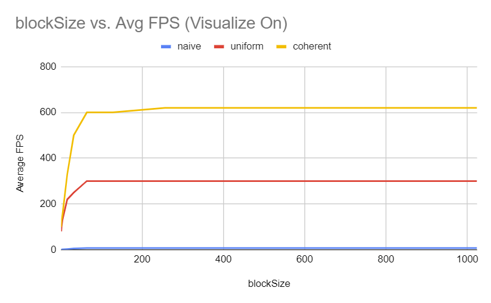

# University of Pennsylvania, CIS 565: GPU Programming and Architecture, Project 1 - Flocking

* Di Lu
  * [LinkedIn](https://www.linkedin.com/in/di-lu-0503251a2/)
  * [personal website](https://www.dluisnothere.com/)
* Tested on: Windows 11, i7-12700H @ 2.30GHz 32GB, NVIDIA GeForce RTX 3050 Ti

## Introduction

In this project, I simulate flocking behavior for a 200 x 200 x 200 cube of scattered boids by using CUDA kernel functions
to calculate their position and velocity on each dT. Based on Craig Reynold's artificial life program, for which a SIGGRAPH paper was written in 1989,
the following three behaviors are implemented:

1. cohesion - boids move towards the perceived center of mass of their neighbors
2. separation - boids avoid getting to close to their neighbors
3. alignment - boids generally try to move with the same direction and speed as
their neighbors

In the simulation results, the color of each particle is a representation of its velocity.

_Coherent Grid Flocking with 50,000 boids_

## Implementation and Results
To measure the performance of my code, I ran my program on release mode with VSync disabled. There are 
three implementations: with the first being naive neighbor search, and each subsequent part 
utilizing more optimizations.

#### Part 1. Naive Boids Simulation

The first simulation is a naive neighbor search, where each boid searches every other boid in existence and checks 
whether they are within distance for cohesion, separation, or alignment. If a non-self boid is within any such distance,
then its position and velocity will be taken into account for the respective rule. 

_Naive Grid Flocking with 5,000 boids_

#### Part 2. Uniform Grid Boids

The second simulation is a neighbor search that takes into account the largest neighborhood distance among the 3 rules. 
The simulation space is divided into grid cubes. Using these cubes, Each boid only needs to check the cubes that overlap
with its spherical neighborhood.

Each boid calculates the extremities of its reach by using its own radius and position. With these extremities, I can calculate
the maximum and minimum of my desired cells to scan. Hence, the number of useless boid scans are reduced, resulting in a much
faster simulation!

_Uniform Grid Flocking with 5,000 boids_

#### Part 3. Coherent Grid Boids

The third simulation builds on the second simulation. This time, we also rearrange the position and velocity information such that 
boids that are in a cell together are also contiguous in memory. 

_Coherent Grid Flocking with 5,000 boids_

## Part 3. Overall Performance Analysis

* Number of Boids vs. Performance

* BlockSize vs. Performance (N = 100,000)

* For the coherent uniform grid: did you experience any performance improvements
with the more coherent uniform grid? Was this the outcome you expected?
Why or why not?

* Did changing cell width and checking 27 vs 8 neighboring cells affect performance?
Why or why not? Be careful: it is insufficient (and possibly incorrect) to say
that 27-cell is slower simply because there are more cells to check!

## Part 4: More Images and Results!

## Part 3: Performance Analysis
For this project, we will guide you through your performance analysis with some
basic questions. In the future, you will guide your own performance analysis -
but these simple questions will always be critical to answer. In general, we
want you to go above and beyond the suggested performance investigations and
explore how different aspects of your code impact performance as a whole.

The provided framerate meter (in the window title) will be a useful base
metric, but adding your own `cudaTimer`s, etc., will allow you to do more
fine-grained benchmarking of various parts of your code.

REMEMBER:
* Do your performance testing in `Release` mode!
* Turn off Vertical Sync in Nvidia Control Panel:

* Performance should always be measured relative to some baseline when
  possible. A GPU can make your program faster - but by how much?
* If a change impacts performance, show a comparison. Describe your changes.
* Describe the methodology you are using to benchmark.
* Performance plots are a good thing.

### Questions

There are two ways to measure performance:
* Disable visualization so that the framerate reported will be for the the
  simulation only, and not be limited to 60 fps. This way, the framerate
  reported in the window title will be useful.
  * To do this, change `#define VISUALIZE` to `0`.
* For tighter timing measurement, you can use CUDA events to measure just the
  simulation CUDA kernel. Info on this can be found online easily. You will
  probably have to average over several simulation steps, similar to the way
  FPS is currently calculated.

This section will not be graded for correctness, but please let us know your
hypotheses and insights.

**Answer these:**

* For each implementation, how does changing the number of boids affect
performance? Why do you think this is?
* For each implementation, how does changing the block count and block size
affect performance? Why do you think this is?
* For the coherent uniform grid: did you experience any performance improvements
with the more coherent uniform grid? Was this the outcome you expected?
Why or why not?
* Did changing cell width and checking 27 vs 8 neighboring cells affect performance?
Why or why not? Be careful: it is insufficient (and possibly incorrect) to say
that 27-cell is slower simply because there are more cells to check!

**NOTE: Nsight performance analysis tools *cannot* presently be used on the lab
computers, as they require administrative access.** If you do not have access
to a CUDA-capable computer, the lab computers still allow you to do timing
mesasurements! However, the tools are very useful for performance debugging.
