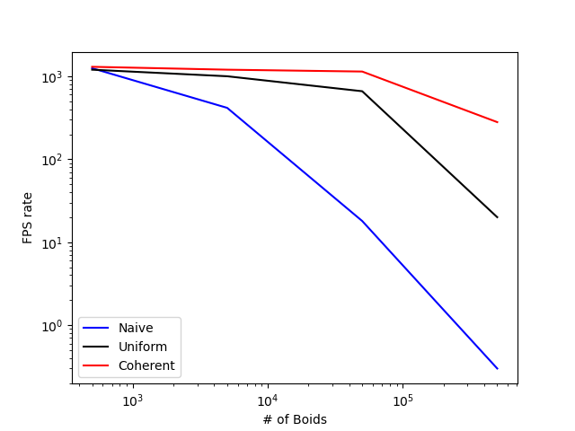

**University of Pennsylvania, CIS 565: GPU Programming and Architecture,
Project 1 - Flocking**
====================

* Zhangkaiwen Chu
  * [LinkedIn](https://www.linkedin.com/in/zhangkaiwen-chu-b53060225/)
* Tested on: Windows 10, R7-5800H @ 3.20GHz 16GB, RTX 3070 Laptop GPU 16310MB (Personal Laptop)

Results
====================

5k Boids

1000k Boids

Performance Analysis
====================
I use the provided framerate meter as the metric. Its not very accurate, but still makesense.

##Questions

**For each implementation, how does changing the number of boids affect performance? Why do you think this is?

* For naive implementation, FPS rate always lower when the number of boids increases. This is because the cumputation load is O(n^2), and the cache is not fully utilized.

* For Uniform Grid, the FPS rate decreases slowly before 10k Boids. The cache is still not fully utilized, but better than the naive implementation. The computation load is also greatly reduced.

* For coherent Grid, the FPS rate also decrease slowly before 10k Boids, and is better than uniform grid. It utilizes the cache better, and havfe fewer memory reads.

**For each implementation, how does changing the block count and block size affect performance? Why do you think this is?

* For naive implementation, FPS rate goes up when the blocksize increases, and reaches maximum with block size = 128. After that, the FPS rate goes down. This is because a single thread has a lots of work to do. Too small block size will harm the performance of a single thread severly, and lower the overall performancce. While too large blocksize will have much brance divergence, and lower the paralleling.

* For Uniform Grid and coherent, the trend is the same, while the threshold changes. The FPS rate didn't goes up or drop dramatically, since a single task do not need to do much work.

**For the coherent uniform grid: did you experience any performance improvements with the more coherent uniform grid? Was this the outcome you expected? Why or why not?

* I experence performance improvement as expected. This tis because it utilized the cache better, and have fewer memory reads.

**Did changing cell width and checking 27 vs 8 neighboring cells affect performance?Why or why not? Be careful: it is insufficient (and possibly incorrect) to say that 27-cell is slower simply because there are more cells to check!

* For 500k boids and coherent grid, 27 cell and half cell width has 430 FPS, while 8 cell and full width has 300 FPS.

* For 50k boids and coherent grid, 27 cell and half cell width has 960 FPS, while 8 cell and full width has 1220 FPS.

* For 5k boids and coherent grid, 27 cell and half cell width has 1341 FPS, while 8 cell and full width has 1305 FPS.
 
This may result from different utilization of cache. For 8 cell with full width, it need to compare more boids, the calculation load is larger. However, for 50k boids, maybe x and y axis can fit the cache, and it only need to reload the cache for four times in a single thread. While for 27 cells, maybe it need to reload 9 times, so in this case 8 cell is faster than 9 cell. In the other case, the cache utilization may have no large difference, so the lower computation load result in higher FPS rate.
