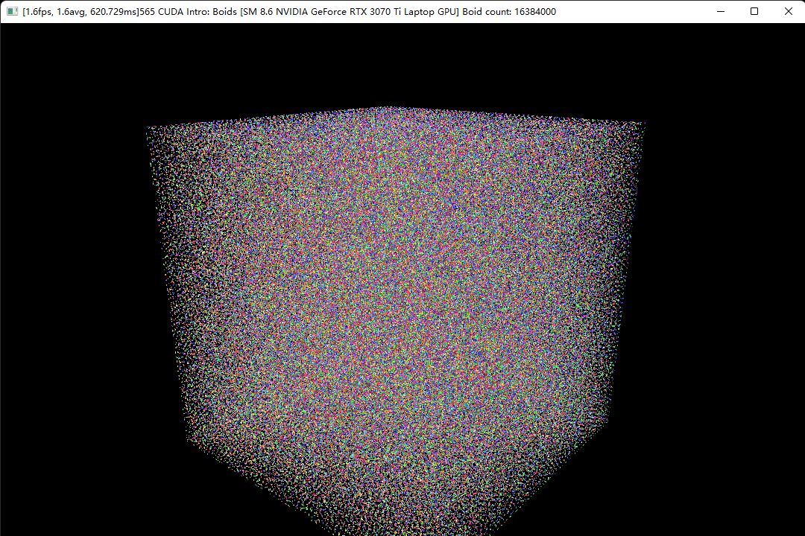
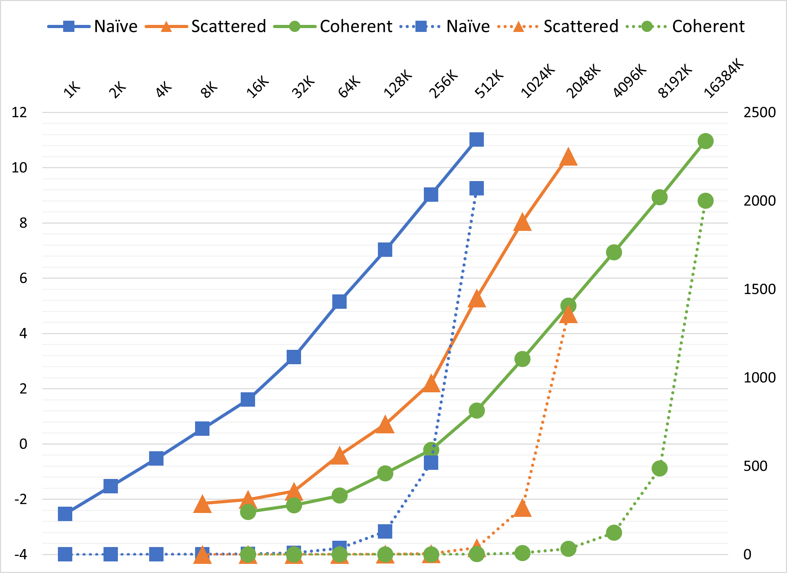
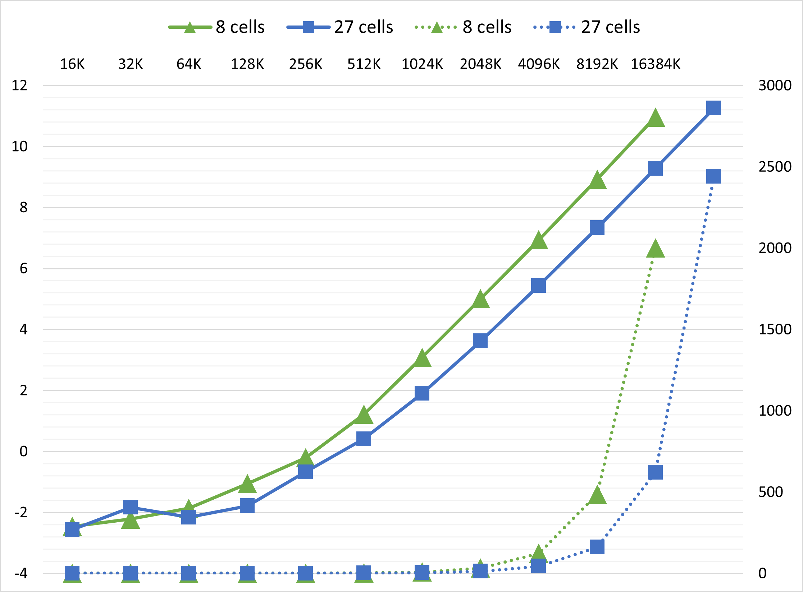

### **University of Pennsylvania, CIS 565: GPU Programming and Architecture, Project 1 - Flocking**

* Chang Liu
  * [LinkedIn](https://www.linkedin.com/in/chang-liu-0451a6208/)
  * [Personal website](https://hummawhite.github.io/)
* Tested on personal laptop:
  - Windows 11
  - i7-12700 @ 4.90GHz with 16GB RAM
  - RTX 3070 Ti Laptop 8GB


<div align="center">256K particles</div>


<div align="center">70 fps with 2M particles. Real time!</div>



<div align="center">Even 16384000 particles it bares!</div>

## Performance Analysis

### Test Case Design

Since our three methods display huge performance difference and generate valid measurements only within specific ranges of boid number (e.g., 1K ~ 0.5M for naive method and 10K ~ 10M for coherent uniform grid), I let the number of boids increase exponentially by testcases. The number of boids starts at 1K and double each time, until the tested method is unable to work real-time (e.g., time of one simulation step > 1s)

The same approach is applied to measure the effect of block size. Tested block size starts at 32 (warp size) and ends at 1024 (hardware limit).

### Metrics

For more accurate measurement, I chose `cudaEventElapsedTime` to record the exact execution time of kernels that are only involved in simulation of boids, excluding the time spent for GL visualization. `cudaEventElapsedTime` provides metrics precise to 0.01 millisecond.

I wrote some code in the program to calculate average simulation time and framerate.

### Effect of Boid Number

Block size is set to 256 for all test results below.

#### Framerate Change


<div align="center">Framerate change with increasing number of boids. X-axis: number of boids. Y-axis: framerate. Solid line: with visualization. Dashed line: with visualization</div>

For each method, the framerate decreases with increasing number of boids. All three methods show similar tendencies without visualization. And it's pretty straightforward to see that coherent uniform grid > scattered uniform grid >> naive method in performance.

Simple modification of memory access pattern from scattered uniform grid to coherent uniform grid leads to significant improvement. This is not a surprise. With coherent uniform grid, when searching neighboring cells, the position & velocity data of boids we access distribute in a smaller range, which is much more friendly to L1 cache compared to "randomized" access of scattered uniform grid.

Note: When visualization is turned on, the average framerate doesn't reflect actual performance, because my laptop doesn't support direct presentation of frames from discrete GPU to monitor. It takes the integrated GPU ~1.5ms to forward frame buffers, so the framerate will always be limited under 700 (and it's *really* unstable to be precisely measured due to other factors in the OS). With sufficiently large number of boids, framerates with and without visualization finally converge because in this case simulation time >>> vertex buffer filling  + drawing + frame presenting time.

#### Simulation Time Change

The graph of framerate provides us with a clear outline of boid number's effect on performance. To make one step further, I measured the execution time of function `Boid::stepSimulation...` of three methods.

Since the number of boids tested increased exponentially, I also plotted the logarithm of simulation time. By measuring the slope of log2(time) to log2(boid number / 1000), we are able to know basically the exponent of time complexity.



<div align="center">Change of simulation time (dashed line), log2 of simulation time (solid line) with increasing number of boids. </div>
<div align="center">X-axis: number of boids. Y-axis-L: log2 of simulation time. Y-axis-R: simulation time (millisecond)</div>

For example, when boid number is sufficiently large, $log_2(t_{simulation})$ and $log_2(n_{boid})$ are almost linear for all of three methods. If we calculate the slope of green solid line at 4096K, we get approximately 2, meaning the time complexity at the spot is $O(n_{boid}^2)$. This meets our expectation: if $n_{boid}$ >> $n_{cell}$, every cell is filled up with $n_{boid}/n_{cell}$ boids on average. Each thread needs to check $8 n_{boid}^2/n_{cell}$ boids and $8/n_{cell}$ is regarded relatively as a constant, so we get $O(n_{boid}^2)$.

All three algorithms show sublinear time complexity with small number of boids and superlinear time complexity with large number of boids. I think this reflects `a change in grid data structure from sparse to dense`.

### Effect of Block Size

The number of boids is 256K. I use two charts to present data because it is hard to plot them in a graph.

| Block Size         | 32   | 64   | 128  | 256  | 512  | 1024 |
| ------------------ | ---- | ---- | ---- | ---- | ---- | ---- |
| FPS Naive Method   | 1.5  | 2.0  | 2.0  | 2.0  | 2.0  | 2.0  |
| FPS Scattered Grid | 210  | 185  | 183  | 186  | 188  | 181  |
| FPS Coherent Grid  | 579  | 760  | 786  | 775  | 760  | 770  |

<div align="center">Framerate change</div>

| Block Size          | 32   | 64   | 128  | 256  | 512  | 1024 |
| ------------------- | ---- | ---- | ---- | ---- | ---- | ---- |
| Time Naive Method   | 665  | 509  | 509  | 509  | 509  | 509  |
| Time Scattered Grid | 4.21 | 4.80 | 4.86 | 4.80 | 4.71 | 4.96 |
| Time Coherent Grid  | 1.28 | 0.87 | 0.83 | 0.84 | 0.87 | 0.84 |

<div align="center">Simulation time change (ms)</div>

When block size is greater than 64, the change in performance is slight. This is easy to explain: changing block size doesn't change the pattern of calculation and memory access since we are using 1D thread hierarchy and parallel executing is guaranteed every 32 threads.

However, when block size is exactly the same as warp size, it becomes an interesting story. For naive method and coherent uniform grid, the performance is worse.

For this phenomenon, I came up with one possible explanation: L1 cache hit rate of each SM. As we know, each block is assigned to an SM during execution, so an SM can hold more blocks if block size is smaller. Naive method and coherent uniform grid access memory in more coherent patterns, so it's better that an SM holds blocks that access neighboring memory regions. For block size of 32, each SM holds many blocks accessing different memory regions, then data hardly stay in L1 cache for faster access. As for scattered uniform grid, smaller block size doesn't change the fact that its data are originally scattered over the memory.

Meanwhile, the performance of scattered uniform grid is better at block size of 32, in contrast to other two. I still don't figure out the reason.

### 27 vs. 8

To search 27 neighboring cells instead of 8, we need two modifications:

1. Change cell width from `2 * max(ruleRanges)` to `max(ruleRanges)`
2. Loop `3^3` times in kernels

The graph below shows the impact of searching 27 cells with coherent uniform grid:



<div align="center">Change of simulation time with increasing number of boids.</div>
<div align="center">Dashed line: simulation time. Solid line: log2 of simulation time</div>

Searching 27 cells is another great optimization. Not only this applies to coherent uniform grid, but also scattered uniform grid. The algorithm has nearly 3x speedup when boid number is considerably large.

My explanation is based on observation and my pervious assumption:

- The width of space we search becomes 3/4 as before. When boids is super dense in the grids, the time of global memory access becomes 27/64, less than a half as before.


- At the same time, the effect of `change in grid data structure from sparse to dense` is delayed. More boids are required to trigger this effect, so our algorithm can enjoy sub $O(n^2)$ time complexity with larger boid number.

## Something Else

#### A Simple, Different Implementation of `kernIdentifyCellStartEnd()`

We can use atomic operations to push the [start, end] range boundary like this:

```C++
int boidIdx = blockDim.x * blockIdx.x + threadIdx.x;
int cellIdx = cellIndex[boidIdx];
atomicMin(&cellStartIndices[cellIdx], cellIdx);
atomicMax(&cellEndIndices[cellIdx], cellIdx);
```
