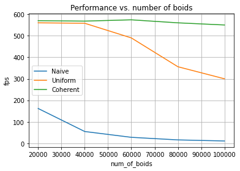
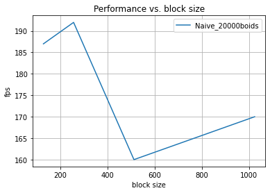

**University of Pennsylvania, CIS 565: GPU Programming and Architecture,
Project 1 - Flocking**

* Yilin Li 
* Tested on: Windows 11, i7-12700H @ 2.3GHz 16GB, GTX 3060 (Personal Laptop)

## Introduction
This project implements a flocking simulation based on the Reynolds Boids algorithm, along with two levels of optimization: a uniform grid, and a uniform grid with semi-coherent memory access.

*Naive Algorithm with 40000 boids and 128 block size.*

*Uniform Grid Search Algorithm with 40000 boids and 128 block size.*

*Coherent Uniform Grid Algorithm with 40000 boids and 128 block size.*

## Performance Analysis 
* For each implementation, how does changing the number of boids affect performance? Why do you think this is?
  * As we can observe from the figure below, increasing the number of boids will decrease the performance badly for the Naive Algorithm. Increasing the number of boids will also decrease the performance of Uniform Search Algorithm but not as bad as Naive Algorithm. Notice that Coherent Algorithm is barely influenced within our tesing range. 
  * The results indicate that 100000 boids is still far away from the limit of Coherent Algorithm. For Naive Algorithm, each thread will search through every other boids in the environment and thus it has the worst performance. For Uniform Algorithm, as number of boids increases, its neighbor candidates increases but the range of searching is 8 grid cells by maximum and thus the performance will not be damaged too bad. The Coherent Algorithm, however, optimize the memeory access which utilizes the power of contiguous memory on blocks. Remeber most of the slowness is caused by memory accessing. 

* For each implementation, how does changing the block count and block size affect performance? Why do you think this is?
  * Changing the block count doesn't affect performance during my testing. Changing the block size, however, influcences the performance in a 'weird' way shown by the figure below. 
  * The results show that increasing the block size could hurt the performance. One reason could that many threads share the common memory resource in a block and too many threads can cause the need of reuse registers and memory space. 

