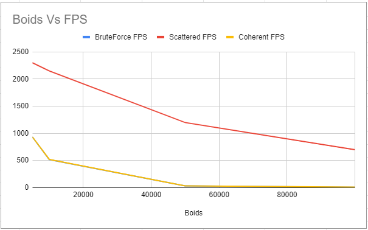
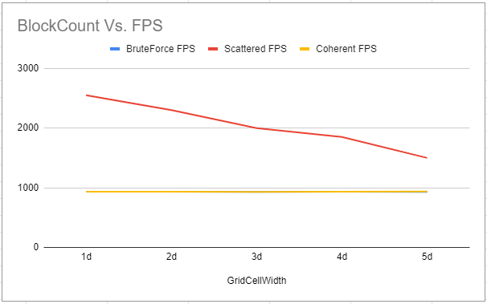
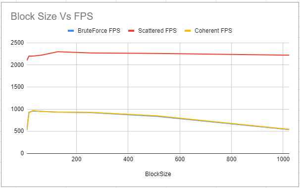

**University of Pennsylvania, CIS 565: GPU Programming and Architecture,
Project 1 - Flocking**

* Edward Zhang
  * https://www.linkedin.com/in/edwardjczhang/
  * https://zedward23.github.io/personal_Website/
 
* Tested on: Windows 10 Home, i7-11800H @ 2.3GHz, 16.0GB, NVIDIA GeForce RTX 3060 Laptop GPU

### ReadMe

Demos:

Naive

Scattered Uniform Grid

Coherent Uniform Grid

* For each implementation, how does changing the number of boids affect
performance? Why do you think this is?

Increasing the number of boids would decreased performance across all implementation types. I think this is because the raw number of computations simply increased as we added more boids since each additional boid meant an additions N+1 calculations per frame.

* For each implementation, how does changing the block count and block size
affect performance? Why do you think this is?

BlockCount is inversely correlated with the length of the GridCellWidth: the larger the width of the cell, the less blocks can fit in the total grid, meaning that block count will be lower. We observe that performance worsens as GridCellWidth increases; I believe this is because increasing gridCellWidth will eventually have us converge back upon the Naive implementation since we'd be comparing against all the boids in the grid.

Until block size reaches a minimum threshold, there simply are not enough threads available to effectly do any work in parallel. Thus, the advantages of parallelism is lost and more of the work is forced to be completed in a series, thus worsening performance. However, past that threshold, performance stables then gently tapers off. This demonstrates that there is likely an optimal blocksize to maximize performance.

* For the coherent uniform grid: did you experience any performance improvements
with the more coherent uniform grid? Was this the outcome you expected?
Why or why not?
I did not see a performance increase; I believe this is because I probably didn't do the sorting aspect of this implementation properly in parallel, meaning that the computational legroom I made for myself by reducing the amount of queries I was making was offset by the sorting action that I had to do. If this had been done correctly, I believe that true removal of need to access global information should have increased the performance of this program.

* Did changing cell width and checking 27 vs 8 neighboring cells affect performance?
Why or why not? Be careful: it is insufficient (and possibly incorrect) to say
that 27-cell is slower simply because there are more cells to check!

It did not alter frame rate that much; I believe this is because while we are checking more grids for neighbors, those grid cells ultimately have less boids in them. Thus there is a trade off between checking more grids and comparing with less voids.

Include screenshots, analysis, etc. (Remember, this is public, so don't put
anything here that you don't want to share with the world.)
