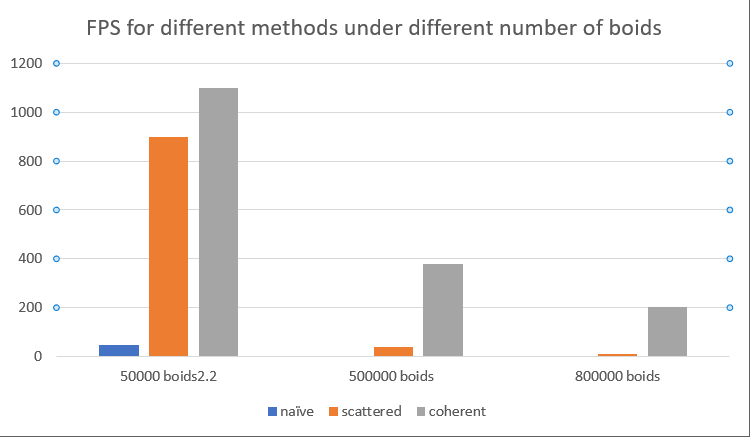
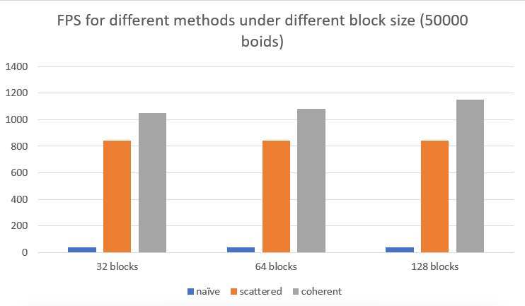

**University of Pennsylvania, CIS 565: GPU Programming and Architecture,
Project 1 - Flocking**

* Guanlin Huang
  * [LinkedIn](https://www.linkedin.com/in/guanlin-huang-4406668502/), [personal website](virulentkid.github.io/personal_web/index.html)
* Tested on: Windows 11, i9-10900K @ 4.9GHz 32GB, RTX3080 10GB; Compute Capability: 8.6
# Screenshots
## 50000 boids with naive, scattered and coherent method

### Performance Analysis

The average FPS of the first 10 second is measured; reasonable amount of waiting is performed to minimize thermal throttling.
The results show that the FPS drops significantly as boid number increases; the difference between scattered and coherent memory method is more noticable as the number of boids increases. 
However, no significant differences among different block sizes at the same boid size. 

### Questions

* For each implementation, how does changing the number of boids affect
performance? Why do you think this is?
The FPS drops significantly as boid number increases. It is because at each tick, the calculation needed to get the change in velocity increases as boid number increases.

* For each implementation, how does changing the block count and block size
affect performance? Why do you think this is?
 No significant differences among different block sizes at the same boid size. It could be that we haven't hit the throttling point, or the hardware-level of optimization is done at different block size.

* For the coherent uniform grid: did you experience any performance improvements
with the more coherent uniform grid? Was this the outcome you expected?
Why or why not?
Yes.the difference between scattered and coherent memory method is more noticable as the number of boids increases. 
As the number of boids increases, the time complexity for scattered method increases whereas the coherent method stays relatively constant.

* Did changing cell width and checking 27 vs 8 neighboring cells affect performance?
Why or why not? Be careful: it is insufficient (and possibly incorrect) to say
that 27-cell is slower simply because there are more cells to check!
I did the grid optimization to avoid hard coding. But if I were to guess, the 27-cell might be faster in cases where the number of boids are high enough that
checking only 8 cells would result more complicated calculation overall.